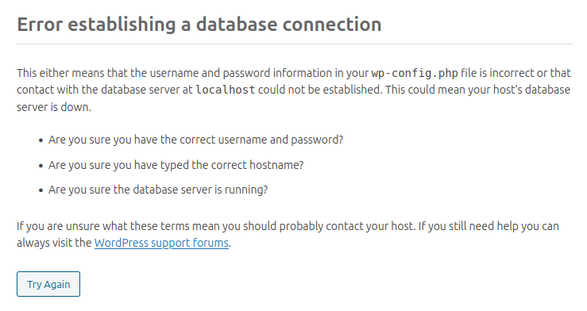
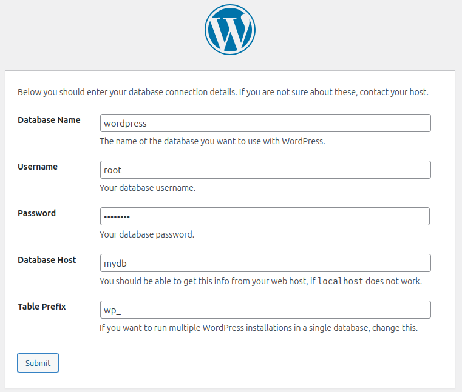

# Docker compose

First, lets run wordpress from CLI:

```bash
docker run –rm -p 8080:80  wordpress
```

- I use `docker run` to create new container
- *Use `--rm` to remove after stop
- Access to container `80` by host `8080` port

- `wordpress` Download wordpress image from docker hub registry (big default docker image library)

Try set up Wordpress by http://127.0.0.1:8080

You will face with DB error. You don't have DB yet. What to do? Run another DB container by CLI? No! Instead of manually running a separate database container via CLI, you can use Docker Compose. Docker Compose simplifies the process by allowing you to define and manage multiple containers (e.g., WordPress and its database) in a single configuration file.




## compose.yaml

Docker Compose is a powerful tool for defining and running multi-container Docker applications. It allows you to describe all your container configurations, options, and relationships in a single `docker-compose.yaml` file. This eliminates the need to repeatedly type complex CLI commands for container setup.

Instead of running multiple CLI commands for your containers, you can simply execute the following command:

```bash
docker compose up -d
```

- up: Starts and runs all services defined in your `docker-compose.yaml`.
- `-d`: Runs the containers in detached mode (background). For testing or development, you can omit `-d` to see logs directly in the terminal.

Did you remember previous example regarding CLI?

>			docker run --name myng --rm -p 8080:80 -v ./:/data -d nginx
>			
>			- I will run `docker`: This is the main command to interact with Docker.
>			- With the `run` command: This creates and starts a new container.
>			- Set the container name to `myng`: Using the option `--name myng`.
>			- Automatically delete the container after stopping it: Achieved using the `--rm` option.
>			- Publish a port to the host:
>			  - Nginx listens on port `80` inside the container.
>			  - Since containers are isolated, I will publish the container's port `80` to the host's port `8080` using `-p 8080:80`.
>			  - This allows access to Nginx on the host machine via `127.0.0.1:8080`.
>			- Share the current folder (`./`) with the container:
>			  - The current folder is mounted to `/data` in the container using the `-v ./:/data` option.
>			  - Docker will create the `/data` folder inside the container if it doesn’t already exist.
>			- Run the container as a daemon (**optional**):
>			  - By using the `-d` option, the container runs in the background.
>			  - If I want to see the logs in the terminal in real-time, I can omit the `-d` option.

Let's convert Ngnix CLI to docker compose.

**docker-compose.yaml**

```yaml
services:
  web:
    image: nginx
    ports:
      - "8080:80"
    container_name: myng
    volumes:
      - ./:/data
```

In this docker compose file all CLI commands are converted. 

YAML files are sensitive to spaces and tabs. It’s crucial to maintain the correct indentation to avoid errors.

By using `services`, you declare that all subsequent configurations in the file pertain to Docker containers and their respective options. Each service represents a container or group of containers defined with specific settings such as image, ports, volumes, and more.

By using `web`, I declare the technical name (or, for better understanding, the container hostname) of the Nginx Docker container.


Now, let's convert WordPress CLI to compose file and attach database also


**docker-compose.yaml**

```yaml
services:
  wordpress:
    image: wordpress
    ports:
      - "8080:80"
  mydb:
    image: mysql
    environment:
      - MYSQL_ROOT_PASSWORD=password
      - MYSQL_DATABASE=wordpress

```


Under `services`, I have declared two Docker containers: `wordpress` and `mydb`.

According to the official MySQL Docker image repository, I have added two `environment` variables:
- **MYSQL_ROOT_PASSWORD**: Sets the root password for the MySQL server.
- **MYSQL_DATABASE**: Specifies the name of a database to be created during container initialization.

The environment option is an efficient way to pass variables into a Docker container. In this case. 

During the initialization of the MySQL container, predefined scripts use these environment variables to set the root password and create a new database with the specified name (wordpress).

This approach ensures that configuration is automated and consistent every time the container starts.

And now by URL http://127.0.0.1:8080/wp-admin/setup-config.php?step=1 I can set-up wordpress page



- Database Name - this value is from Environment variable `MYSQL_DATABASE`

- Username - Default root user - `root`

- Password - this value ir from Environment variable `MYSQL_ROOT_PASSWORD`

- Database Host:

  :exclamation: :warning: **IMPORTANT**

To enable communication between Docker containers, you don’t need to know the IP addresses of the hosts. Instead, you only need to know the hostname of the Docker container.

In this example, within the `docker-compose.yaml` file under `services`, I have declared two Docker containers: `wordpress` and `mydb`. Both containers can "see" each other by their hostnames.

For this reason, I used `mydb` (the hostname of the database container) instead of an IP address in the **Database Host** field when configuring WordPress. This makes container communication seamless and dynamic, as hostnames are automatically resolved within the Docker network.

  
